# Github action 自动部署vuepress

### 1.首先上传项目到github 
新建个人仓库
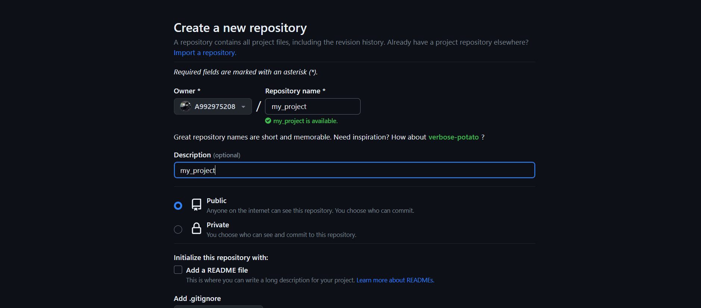
上传项目到仓库
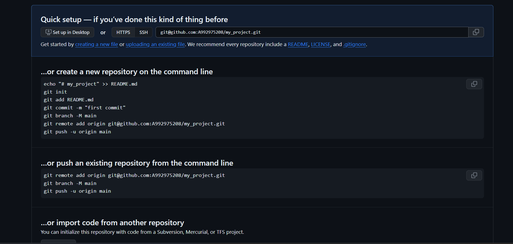

### 2.创建一个个人的ACCESS_TOKEN
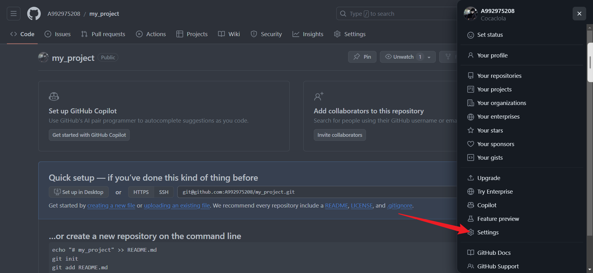
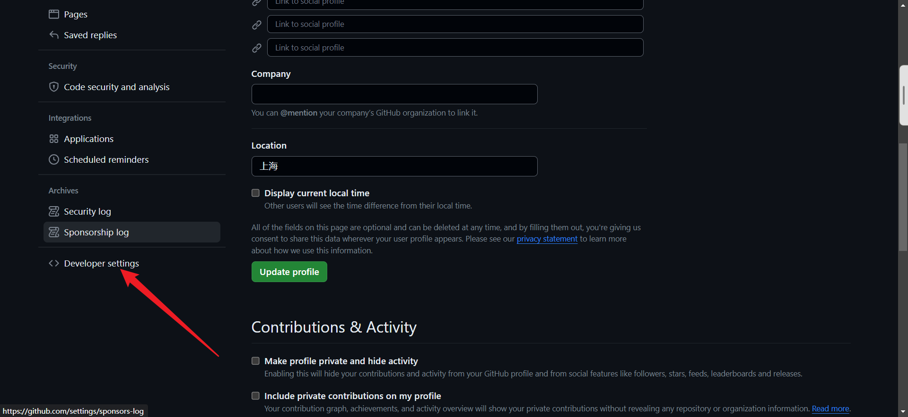
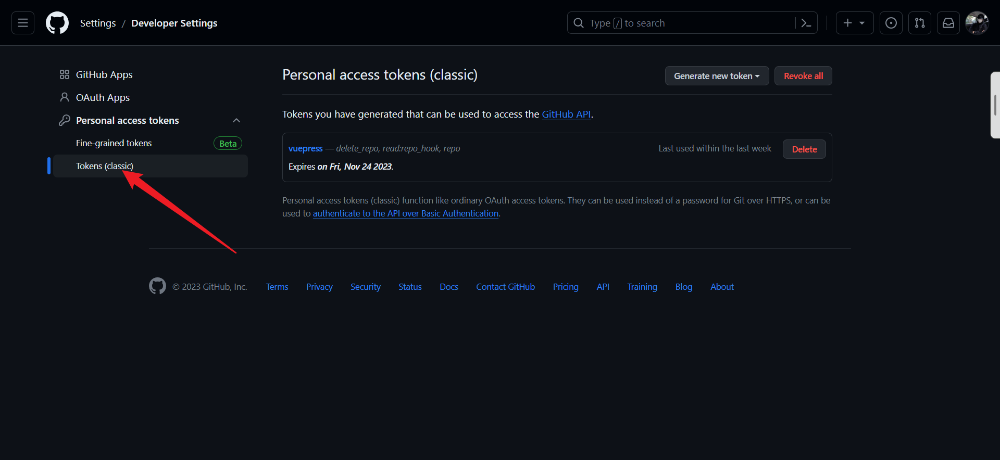
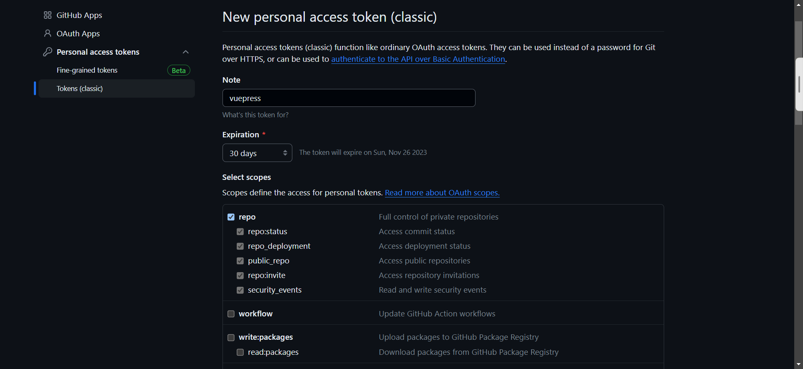
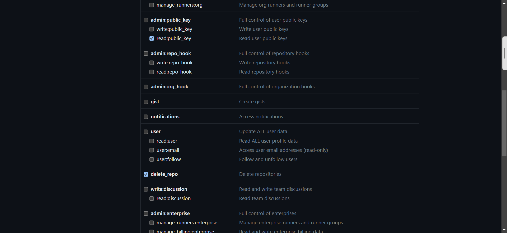

在个人项目设置中去添加ACCESS_TOKEN
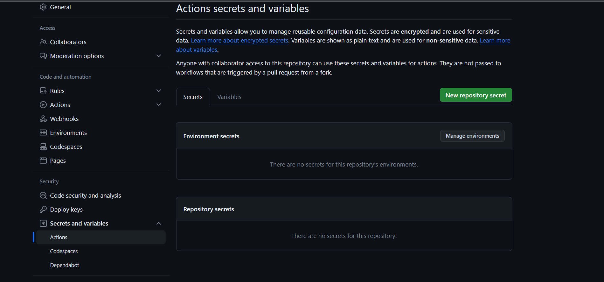
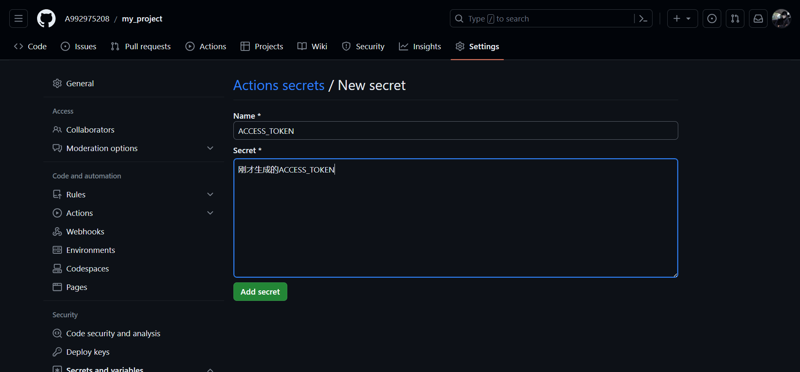

在项目的action中去添加main.yml
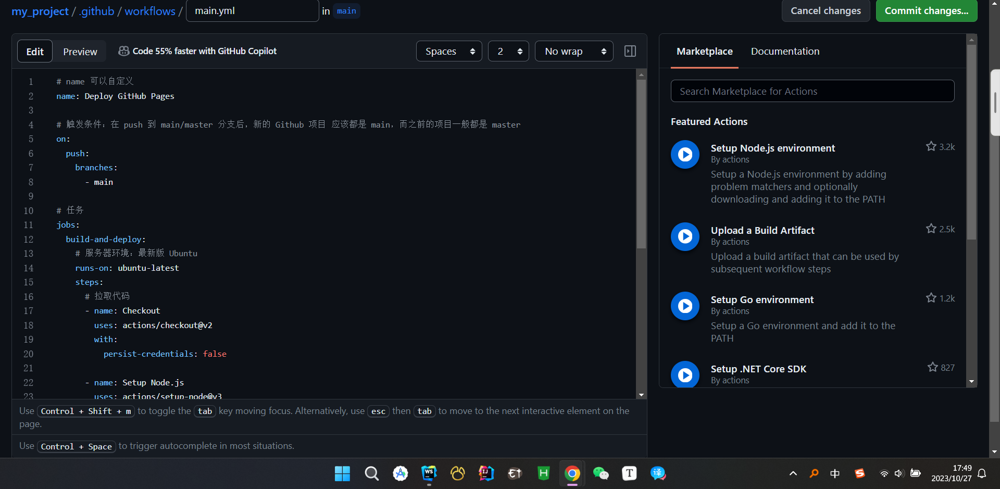
    
去给项目的Github Pages添加自定义域名
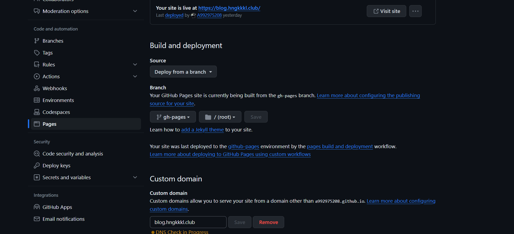

在服务器中去给Github Pages重定向到指定域名
